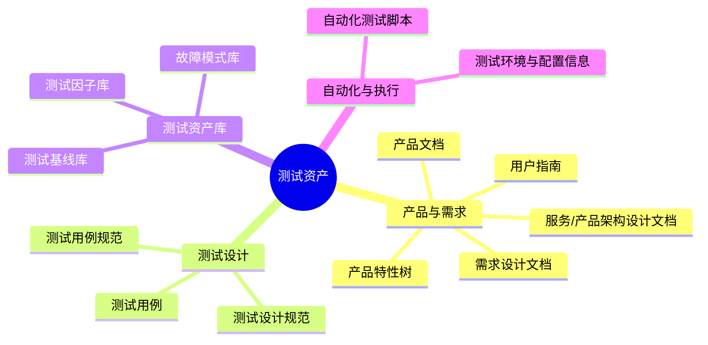

测试工作中沉淀了大量资产。大致可以形成这样一张地图：




这些领域资产如何让模型更好地理解、吸收并使用，一直是测试工程师在 AI 辅助实践中绕不开的问题。

从训练垂直领域模型、作为Few-shots嵌入提示词工程，到 RAG 语义层嵌入、Skills渐进式披露，测试领域的探索几乎一直跟随着 AI 应用范式的演进。

有意思的是，随着模型能力不断增强，**我们原本以为需要不断“喂给 AI”的东西，正在被 AI 以另一种方式重新理解。**

---

## 从训练模型开始

LLM 刚进入工程领域时，测试行业很自然地想到了一条路径：

**训练一个懂测试的模型。**

用大量测试用例、测试规范、缺陷数据、自动化脚本对模型进行训练，让它逐渐掌握测试领域的知识和经验。

这条路在大型公司的测试中台确实具备一定可行性：它们拥有足够多的历史测试数据和领域资产，也有资源完成数据清洗、模型训练和后训练。

但对于绝大多数测试团队而言，这条路的成本并不低。

更重要的问题是：**模型训练的周期，开始赶不上 AI 能力迭代的速度。**

等数据完成治理、模型完成训练、产品完成接入，也许下一代模型已经出现了。

于是，人们开始寻找一种更轻量、更灵活的方式。

---

## 提示词工程：先让模型学会怎么做测试

产品侧很快开始尝试提示词工程。

通过 System Prompt、Few-shot、Chain of Thought 等方式，为模型增加测试领域的上下文和行为约束。

在测试用例生成这类单一任务上，这种方式已经能够取得相当不错的效果。但这远远不够，软件工程是一个连续迭代的过程，AI仅仅处理一个时间切片上的任务那仅仅只能作为一个效率工具，如何让测试设计有连续性，就需要更复杂的AI工程去解决

---

## RAG + 工作流：让模型获得完整的业务上下文

测试领域开始尝试把需求设计、产品文档、架构文档、测试规范等设计阶段的资产接入 RAG，并进一步搭建工作流，把原本一次性的测试用例生成拆解成多个步骤。

理想的流程大致是：

需求文档
   ↓
RAG 召回相关设计资产
   ↓
需求理解
   ↓
测试场景分析
   ↓
测试点生成
   ↓
测试用例生成


相比直接让模型“根据需求生成测试用例”，这种方式看起来更加工程化。

但实践下来，一个有意思的问题很快出现了：

上下文变多了，结果却不一定变好了。

RAG 首先遇到的是召回问题。

测试领域的知识资产往往具有很强的层次关系：架构文档解释系统边界，需求文档描述变化，产品文档定义能力，特性树组织功能，测试规范约束设计方式，而测试用例又是这些信息最终落地后的产物。

如果只把它们当成互相独立的文本切片进行向量检索，模型拿到的可能只是一些“相关的句子”，却没有拿到这些句子之间的关系。

早期多模态能力的不足也进一步放大了这个问题。很多设计信息存在于架构图、时序图、流程图甚至原型图中，而这些信息很难仅靠传统文本 RAG 完整还原。

知识的“可检索”，和知识的“可理解”，并不是一回事。

---

## 自动化测试：模型开始直接理解工程

与此同时，AI 在测试自动化领域找到了一个更加自然的入口。

Coding Copilot 一类工具出现之后，自动化测试脚本生成本身已经变成了一件相对容易的事情。

尤其对于测试自动化程度较高的团队，AI 的辅助效果往往更加明显。

原因很简单：

**高质量的自动化代码本身就是一种结构化的测试知识。**

一个设计良好的自动化测试项目里，代码已经隐含了很多信息：

```text
测试意图
→ 测试对象
→ 前置条件
→ 数据构造
→ 操作路径
→ 断言
→ 环境依赖
→ 异常处理
```

因此，有时候甚至不需要额外的外挂知识库，只要测试代码本身足够规范，模型就能够从代码结构中反推出测试意图。

**测试自动化率越高，AI 对测试工程的放大效应反而越明显。**

因为自动化代码不仅是执行工具，也是测试知识的一种机器可读表达。

---

## Agent 出现之后，事情开始发生变化

AI Agent 开启了AI智能的新范式：

渐进式披露让模型可以按需加载更长、更复杂的上下文；ReAct 等机制让模型开始真正与环境交互。MCP 让模型能够连接外部工具；

至此，在RAG阶段困扰测试工程师们的问题在skill实践中被解决：

上面提到：
> 测试领域的知识资产往往具有很强的层次关系：架构文档解释系统边界，需求文档描述变化，产品文档定义能力，特性树组织功能，测试规范约束设计方式，而测试用例又是这些信息最终落地后的产物。

一个设计完备的测试工作skill，在SKILL.md中描述测试工作的SOP，需要遵循的规范引用`./references`，需要执行的复杂操作引用`./scripts`, 关键资产引用`./assets`

在整个测试工作流程中，我们可以基于关键节点对应创建：
* 测试设计skill
* 测试执行skill
* 测试审计skill
* 测试负向改进skill

基于不同测试类型，测试设计skill还可以拆分为
* 可靠性专项测试skill
* 性能测试skill
* 兼容性测试skill

基于不同skill，将既有的SOP，测试资产填入skill中规范的目录文件中。Agent通过SKILL.md的路由，索引到相关知识，实现了对知识的“理解”。

测试领域原本需要人类工程师串联起来的：

**理解 → 分析 → 执行 → 观察 → 判断 → 再执行**

开始逐渐被 Agent 接管。

这时候，AI 辅助测试的想象空间一下子从真正理解知识跃迁到了“工程执行”。

从单一一个需求的测试工作评估，AI Agent已经具备一个junoir级别的测试工程师的能力。

紧随其后的Agent Harness在更为复杂的集成测试验证自动化实践中，使用harness工程约束测试框架对代码质量有所提升，通过创建Agent.md明确框架项目概览，集成插件，分层约束，通过定义pyproject.toml锁定依赖，通过定义PROGRESS.md跟踪长任务跨会话进度。进一步提升Agent自主编码的质量。

