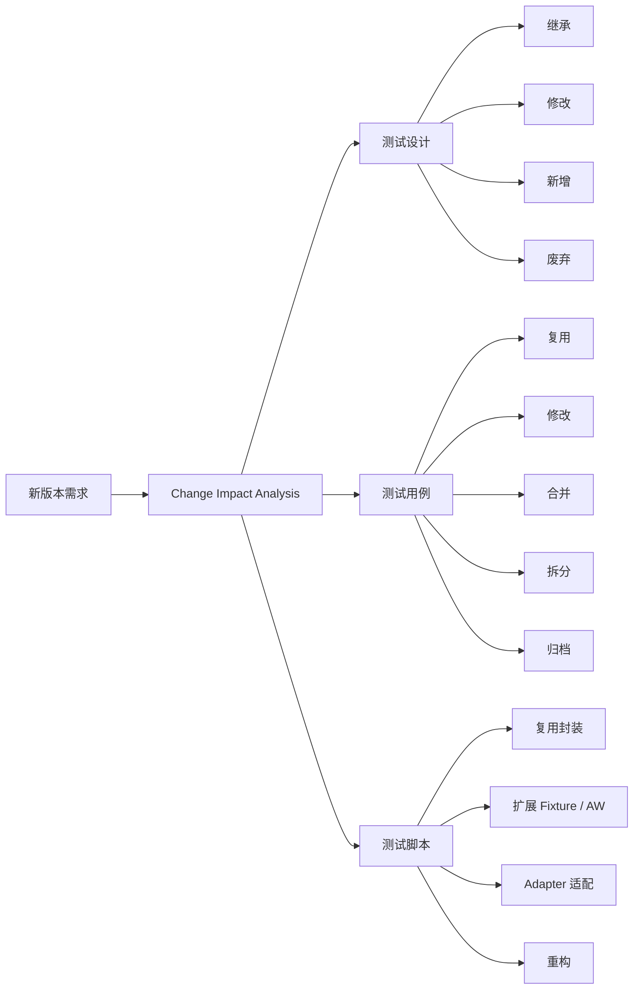
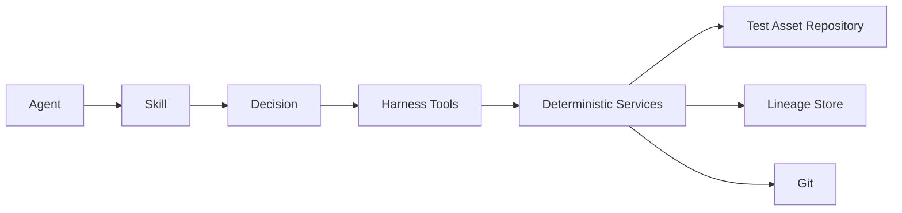
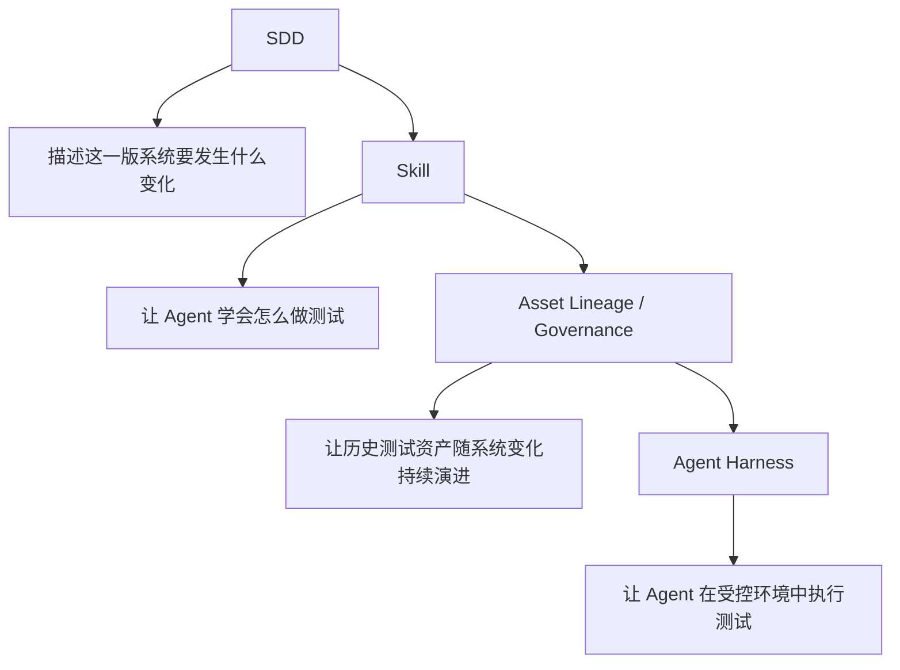
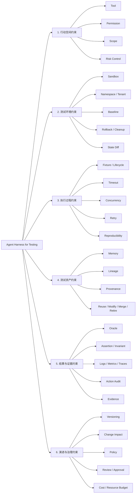
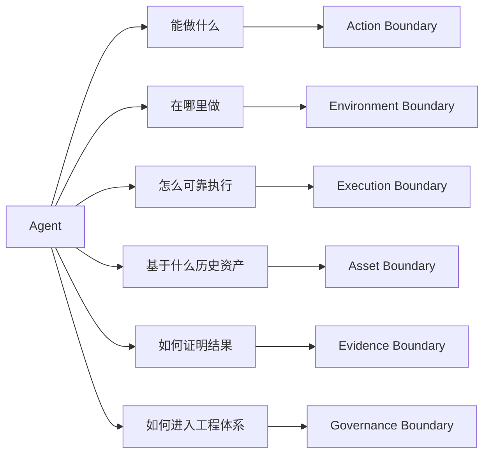
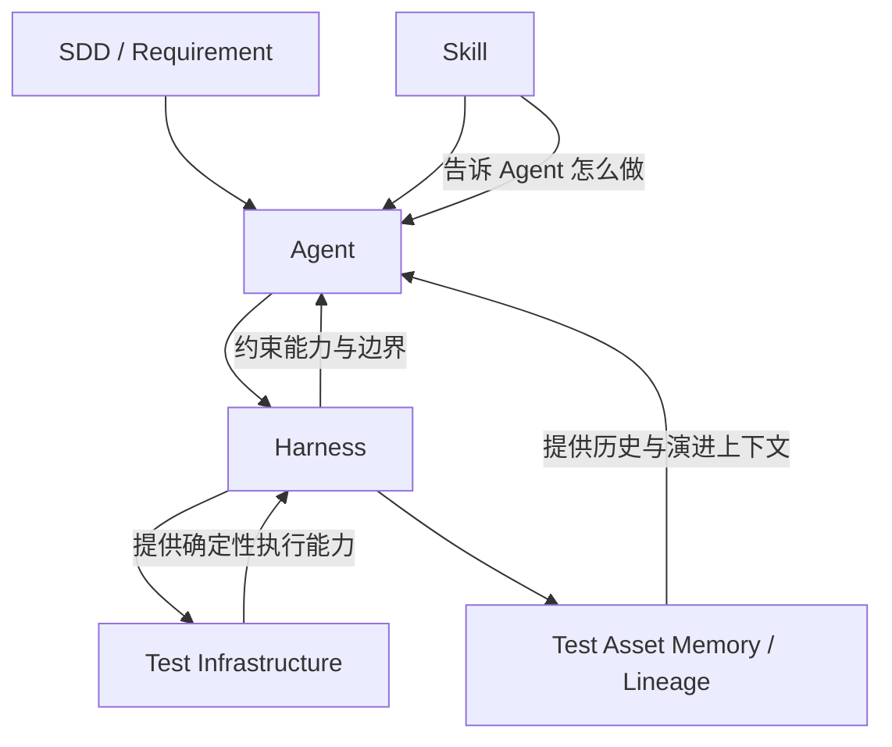

基础的测试SOP被蒸馏到skill中后，Agent看似为测试活动提效了不少，但随之而来出现了新的问题。

# 1. 如何审计生成内容和需求意图的一致性

1.1 测试设计：

基于已有的测试规范及checklist，Agent当前已经能够生成的足够完备的测试设计，但是否完全覆盖需求详设中的修改，是否考虑了足够多的异常和边界覆盖，是否评估了高风险场景下修改引入的影响等，当前还需要人类做评审。

1.2 测试用例：

用例格式完备性是模型的长项，而用例和测试设计的一致性上，从前建立在对人类测试工程师的专业度信任之上，之后可以通过引入测试审计智能体（LLM-as-judge）进行审计。

1.3 测试脚本：

用例脚本的测试意图和测试用例的一致性同理可以用（LLM-as-judge）看护。

# 2. 测试执行完如何保证测试环境中的配置和数据不会被污染

无论如何约束，我们无法保证Agent生成的测试脚本在每次测试执行后，环境不会出现配置污染、数据污染、资源泄漏、状态残留的问题。

例如一个典型的测试用例：

**测试目标：**

> 验证推理服务支持动态修改 `batch_size` 配置，修改后服务能够正常运行，并验证服务重启后配置仍然生效。

```text
Kubernetes Cluster
└── qa namespace
    ├── Deployment: model-server
    ├── ConfigMap: model-server-config
    │     batch_size=8
    └── Test Database
          inference_records
```

测试开始前，环境状态是：

```text
batch_size = 8
model-server replicas = 3
inference_records = 1000 条
```


告诉 Agent：

> 验证将 model-server 的 batch_size 从 8 修改为 32 后，服务可以正常提供推理，并且重启服务后 batch_size 仍为 32。

Agent 自己决定：

```text
1. 查询当前配置
2. 修改 batch_size
3. 重启服务
4. 发起推理请求
5. 检查服务状态
6. 再次读取配置
```

甚至它可能额外：

```text
查询 Pod
查看日志
查看 Events
再次发送请求
```

这都没问题，假设 Agent 测试结束以后：

```text
ConfigMap:
batch_size = 32

Database:
多了 50 条 inference_records

Pod:
多了一个 debug Pod

甚至：
某个共享 ConfigMap 被它改了
```

仅仅要求 Agent最后把东西删掉是不够的

因为 Agent 可能忘记，也可能判断错，更可能它根本不知道哪些状态是原来的。所以可以在 Harness 这样设计：

## 2.1 测试环境必须是 Run-scoped Sandbox

每次 Agent 测试创建独立环境：

```text
Test Run: 20260925-001

qa-agent-20260925-001/
├── model-server
├── model-server-config
└── DB schema: run_20260925_001
```

Agent 只能访问：

```text
namespace = qa-agent-20260925-001
DB schema = run_20260925_001
```

并且 RBAC 明确禁止：

```text
production namespace
shared namespace
other test runs
shared DB schema
```

## 2.2 测试开始前记录 Baseline

Harness 自动记录：

```text
Config
  batch_size = 8
  replicas = 3

Resources
  deployment/model-server
  service/model-server
  configmap/model-server-config

Data
  DB schema = run_20260925_001
  row_count = 1000
```

## 2.3 Agent 自主测试

Agent 可以自由调用 Harness 提供的工具：

```text
get_config()
update_config()
restart_service()
send_request()
query_logs()
query_metrics()
```

例如实际过程：

```text
batch_size: 8
      ↓
Agent 修改为 32
      ↓
restart
      ↓
inference
      ↓
PASS
```

## 2.4 测试完成后，不能只 Cleanup，要做 State Diff

Harness 再次采集环境：

```text
Before                     After

batch_size=8          →    batch_size=32
replicas=3            →    replicas=3
DB rows=1000          →    DB rows=1047
```

然后根据**测试契约**判断。

这里：

```text
batch_size 8 → 32
```

是**预期变化**，因为测试就是验证这个配置。

而：

```text
replicas 3 → 3
```

必须保持不变。

```text
DB rows 1000 → 1047
```

如果这些数据不是测试目标允许产生的，就是污染。


## 2.5 最后恢复环境

Harness 根据测试契约执行：

```text
batch_size
32 → 8

temporary resources
delete

test DB
rollback / discard schema
```

然后再次检查：

```text
Final State

batch_size = 8
replicas = 3
shared resources = unchanged
shared data = unchanged
temporary resources = 0
```

只有全部成立，才算：

```text
Test PASS
Environment CLEAN
```
但是还有一些测试环境不具备sandbox执行条件，依旧可以用Harness进行约束

```
sandbox隔离替换为选择性隔离操作
baseline 依旧可用
state diff  依旧可用
```

---

这里有一个特别关键的设计，不要让 Agent 自己判断：

> “我已经清理干净了。”

而是由**独立于 Agent 的 Harness 验证器**判断。


```text
                 Agent
                   │
            自主执行测试
                   ↓
             Test Result
                   │
                   ↓
        ┌────────────────────┐
        │   Harness          │
        │                    │
        │ Baseline           │
        │ Action Log         │
        │ State Diff         │
        │ Cleanup            │
        │ Final Verification│
        └────────────────────┘
                   ↓
        Environment Integrity
```

---

# 3. Agent自主测试和Agent使用测试框架自动化测试

而还有更高危的用例：没有 sandbox + 没有可靠 rollback 
这时候Harness 就不能给Agent 不应该拥有这个操作权限。

但这并不意味着Agent无法通过pytest自动化框架完成测试，危险操作仍然可以由经过设计和评审的 pytest 自动化执行，但不应该直接作为 Agent 的自由行动能力暴露出去。这里最大的风险不是自动化，而是：

> **行动空间 + 决策权交给了一个非确定性的执行者。**

比如测试：

> 验证数据库 Schema 升级失败时系统能否正确回滚。

pytest 完全可以：

```python
def test_schema_migration_rollback(db):
    apply_migration()
    inject_failure()
    rollback()
    assert_schema_consistent()
```

甚至它可以操作真实测试数据库。

但你不会希望 Agent 得到一个：

```python
execute_sql(sql)
```

然后它为了“验证数据库异常恢复”，自己推理出：

```sql
DROP TABLE xxx;
```

这两个在表面上都是“自动化测试”，但工程风险完全不同。

这其实引出了 Harness 的一个非常有价值的职责

**把 pytest 这样的确定性能力，包装成 Agent 可使用、但不能任意越界的 Tool。**

比如原来：

```text
pytest
 ├── reset_database()
 ├── update_config()
 ├── restart_service()
 └── inject_failure()
```

到了 Agent Harness：

```text
Agent
 ↓
reset_database()
 ↓
Harness Policy
 ├── 是否允许？
 ├── 作用域是什么？
 ├── 当前 Test Run 是谁？
 └── 是否需要人工批准？
 ↓
pytest / automation
 ↓
Environment
```

所以未来很可能不是：

> **Agent 替代 pytest**

而更像：

> **Agent 驱动 pytest，以及其他确定性测试基础设施。**
> **Agent负责决策，pytest负责确定性执行，Harness负责把两者之间的风险边界管起来。**

这是在Agent时代保留测试框架的一个坚实论据，除此之外，Agent自主生成的脚本还存在以下问题：

###  测试脚本的可理解性

一些复杂业务实现上，模型生成的脚本对测试框架已有特性机制、封装分层、编写风格的遵从不足，因为Agent对接的模型是基于coding意图训练的，很多agent模型也是针对coding场景做了专门的设计，用这类Agent编写测试脚本代码时，Agent容易忘记自己在写的是测试脚本，遇到bug时会想办法规避异常。导致脚本逻辑的熵增。而合入评审的权利还在人类手中，这让committer的决策变得十分尴尬。

###  测试脚本的健壮性

编写调试的单个脚本通过，并不意味着在接入流水线批量、并行执行时还能够通过。同样的问题在人类工程师编写时也会遇到，但是在AI生成的脚本后，这些问题的定位和追溯会变得更加困难，更严重的是，一些脚本缺陷污染环境后，如果继续让模型修复，模型会生产出更多混乱而无用的代码。

**而把pytest作为确定性执行工具，并让Agent编码严格遵循pytest框架规范，有助于削减Agent自主生成脚本带来的熵增。**

# 4. 如何治理版本迭代周期下AI生成的测试资产

## 4.1 测试设计的版本连续性：核心是“影响分析”，不是重新生成

测试设计如何获取历史版本的特性演进历史，能否识别当前需求对整体系统的影响，能否从测试用例库中识别到可继承的用例、需要修改的用例、修改删除的用例。

这种历史观，是用简单的SOP提炼出的skill无法拥有的知识面。它更多存在于长期工作在团队中的专家脑海中，散落四处无法全面搜集的技术文档中。人类为了搞清整个演变线索，会遍寻团队知识库，调查代码仓某次提交历史，访谈某个技术负责人。

在AI Native团队中，这种历史观的获取更具有挑战性。AI生成的内容从版本开发初始就参与其中，如何让质量责任人把握其中的演进历史亟待在实践中摸索。


## 4.2 测试用例的版本连续性：核心是“演进和治理”，不是生成更多Case
   
新版本的用例合入到用例集，是否能归档到正确的用例树分支，是否能合并不同场景下相似的用例。

以上治理活动是测试责任人对产品测试用例集的日常维护动作，因为AI agent的引入，用例集的维护更加艰巨但关键，不经维护的用例集，最终会演变成不断熵增，最终无法被任何人理解的坏资产。

如果研发团队都采用AI Native的方式，是否有AI Native的方式维护用例集，如果不维护，如何定义确定性的质量基线，如何抑制测试过程中的熵增也需要在实践中摸索。


## 4.3 测试脚本连续性：核心不是“自动生成代码”，而是“继承现有代码资产”

一个成熟的测试框架不只是一些接口调用和命令行执行的组合，成熟的自动化测试工程有：
```
API Client
Fixture
Factory
Data Builder
Helper
Plugin
Environment Adapter
```

能否在新用例自动化前充分考虑接口封装，AW、Fixture的兼容性和适配，保持测试代码的简洁易读。延续已有测试框架的价值，还是采用AI Native后，不再需要如此精细调配的设计。

综上，版本迭代周期下，真实的测试工作内容


   
以上问题，如果在一个轻量AI Native应用开发中进行质量跟踪，比较合适的方式是对业务进行数学建模，发掘其在空间、时序上流转变化的数学模型。从需求变更跟踪，测试设计，测试自动化及执行，都以数学模型为依据，其他中间产物都先不考虑固化，一切工作围绕数学模型约束下产品实现的结果导向让AI Agent自由探索，最终交付可用的结果。

_见[AI辅助下的测试前移探索：MBT方式的SDT实践](https://sarah-mengqigu.github.io/gumengqi.github.io/test-engineering/2026/09/14/test-engineering3.html)_

而一些更复杂的分布式应用都无法一套简单的数据模型解释所有的业务。就需要整个行业在实践中探索出更多元化的方案。

软件工程领域对以上三个问题最直接的方案就是GIT，[gitbook](https://github.com/GitbookIO/gitbook)就是一个成功的例证。

借鉴Git对代码变动的管理。在测试自动化工程中建立一套提交规范，能够在每次提交中给出足够的信息：

```YAML
id: TC-123
version: 7

derived_from:
  - TC-098

introduced_by:
  requirement: REQ-102
  version: v3

modified_by:
  - change: CHG-331

implemented_by:
  - script: tests/gpu/test_migration.py

status: active
```
这样Agent就能理解：这个 Case 不是凭空出现的，它是 TC-098 演进过来的。配合约束所有自动化脚本注释中都写入完整的文本用例，那么Git就提供了更加全面的测试用例演变史的溯源能力。

在测试设计阶段，可以借鉴传统的 _[RTM（Requirements Traceability Matrix）](https://www.atlassian.com/software/jira/templates/requirements-traceability-matrix?utm_source=chatgpt.com)_

让Agent能在Matrix中，通过测试用例等交付物，溯源到需求的关系图谱。再让skill进行测试设计时查询图谱，搞清楚需求演变的过程，和这个过程中测试用例的变化，进一步通过git找到用例的详细变动。

怎么让 Agent “掌握”这些东西？

把以上问题需要进行图谱化检索的指令和工具作为skill —— skill会非常臃肿，导致模型的渐进式加载机制失灵。

一个更符合主流趋势的尝试：一部分可以作为skill约束要求在执行测试工作时，让Agent在行动前强制遵循，另一部分基础工具，沉淀到Agent Harness，作为Harness Tool，



围绕AI Agent的测试的范式大致可以被描述成如下示意图：



skill中约束：

```yaml
BEFORE generating a new test asset:

1. Identify the changed requirement.
2. Find historical versions of the requirement.
3. Find related test designs.
4. Find related test cases.
5. Find existing automation implementation.
6. Trace dependencies and historical changes.
7. Classify assets:
   reuse / modify / merge / retire / create.
8. Reuse existing abstractions whenever possible.
9. After modification, record lineage.
10. Never create a new asset solely because a semantically similar asset
   was not immediately retrieved.
```

Harness Tools:

```python
find_related_test_assets()
get_asset_history()
get_asset_lineage()
analyze_requirement_impact()
find_reusable_test_cases()
find_reusable_test_implementation()
find_similar_test_cases()
get_change_evidence()
```

# 5. 总结

Agent阶段，人们关注如何驾驭智能体，测试领域的 Agent Harness，本质上是在约束 Agent 的行动空间、环境状态、执行过程、测试资产、结果证据和工程演进。




## 5.1 行动空间约束：Agent“能做什么”

这是最直接的一层。

Agent 不是直接拿到：

```text
kubectl
shell
数据库 root
云平台管理员权限
```

而是通过 Harness 暴露：

```text
create_test_pod()
update_test_config()
restart_service()
query_logs()
send_request()
inject_failure()
```

Harness 再控制：

```text
谁能调用
能调用什么
作用于哪些资源
什么参数允许
什么操作需要审批
```

核心思想是：

> **把 Agent 的自由行动，收敛成一个受控 Tool Space。**

特别是在没有 sandbox 的基础设施里，这一层会非常重要。

---

## 5.2 测试环境约束：Agent“在哪里做、做完以后留下什么”

理想状态：

```text
Agent
 ↓
Sandbox
```

但现实中可能只能：

```text
Agent
 ↓
共享基础设施
```

于是 Harness 需要提供：

```text
逻辑隔离
资源作用域
数据作用域
配置基线
快照
回滚
TTL
Cleanup
Final State Diff
```

所以它真正保障的是：

> **Agent 可以改变环境，但不能无限制地改变环境；测试结束后，环境状态必须满足预定义的完整性条件。**


---

## 5.3 执行过程约束：Agent“怎么稳定地做”

Agent 的决策是动态的，但测试执行本身不能完全动态、随意。

比如下面这些，还是需要确定性的基础设施：

```text
Fixture
Resource Lifecycle
Timeout
Concurrency
Retry
Setup / Teardown
Environment Provisioning
Test Runner
CI
```

所以这里的关系很像：

```text
Agent
负责：
“下一步做什么”

Harness / Test Runtime
负责：
“这一步怎么可靠执行”
```

这也是 pytest 经验可以被继承的地方。

例如：

```text
pytest fixture
        ↓
Harness resource manager
```

```text
pytest parametrization
        ↓
Agent-generated test matrix
```

```text
pytest marker
        ↓
Harness execution policy
```

所以 **pytest 不一定消失，它可能成为 Harness 的确定性 Runtime 能力之一。**

---

## 5.4 测试资产约束：Agent“不要每次从零开始”

Harness 应该让 Agent 能够访问：

```text
Requirement / SDD
Test Design
Test Case
Test Script
Fixture
AW / Adapter
Historical Results
Bug / Incident
Git History
```

同时不仅支持搜索，还要知道：

```text
谁来自谁
谁继承谁
谁替代谁
谁由谁实现
谁受到谁影响
为什么发生过这次修改
```


于是新版本测试就不应该简单变成：

```text
New Requirement
 ↓
LLM
 ↓
New Test Case
```

而应该变成：

```text
Requirement Change
 ↓
Impact Analysis
 ↓
Historical Assets
 ↓
Reuse / Modify / Merge / Retire / Create
 ↓
Record New Lineage
```

这其实是 **Agent Testing 从“生成”进入“工程演进”**的关键。

---

## 5.5 结果与证据约束：Agent“怎么证明自己测对了”

Agent 说：

> “测试通过了。”

这句话本身没有什么工程价值。

Harness 需要要求它产生可验证的 Evidence：

```text
Request / Response
Logs
Metrics
Traces
Environment State
Config Before / After
Action Log
Test Data
Assertions
```

更进一步是定义 **Oracle**：

```text
什么结果才算正确？
什么状态必须保持不变？
哪些变化是允许的？
哪些变化必须恢复？
```

比如：

```text
Functional:
batch_size=32 后 inference PASS

Invariant:
replicas=3
shared config unchanged
shared data unchanged
temporary resource = 0
```

这比单纯让 Agent “判断测试结果”可靠得多。

---

## 5.6 演进与治理约束：Agent“能不能把结果正式纳入工程”

最后一层是：

> **Agent 做出来的东西，什么时候算正式测试资产？**

例如 Agent 自动生成了 20 个 Case。

Harness 不应该直接：

```text
Agent → Test Case Repository
```

而可以要求：

```text
Generated
 ↓
Validation
 ↓
Lineage Check
 ↓
Duplicate / Similarity Check
 ↓
Requirement Traceability
 ↓
Review / Policy
 ↓
Adopt
```

甚至规定：

```text
没有 requirement trace
→ 不允许入库

没有 lineage
→ 不允许合入

发现高度重复 Case
→ 要求先 merge / reuse

危险测试操作
→ 需要人工 approval
```

这一层实际上解决的是：

> **AI 生成能力如何进入企业已有的软件工程治理体系。**

---

## 把这 6 个方面再压缩

> **测试领域的 Agent Harness，本质上是在约束 Agent 的行动空间、环境状态、执行过程、测试资产、结果证据和工程演进。**

也就是：



这样一来，Harness 就不再只是：

> **“给 Agent 一堆工具。”**

而是：

> **“给 Agent 一个能力空间，同时定义这个能力空间的边界。”**

这也能把我们前面聊的几个东西串起来：


